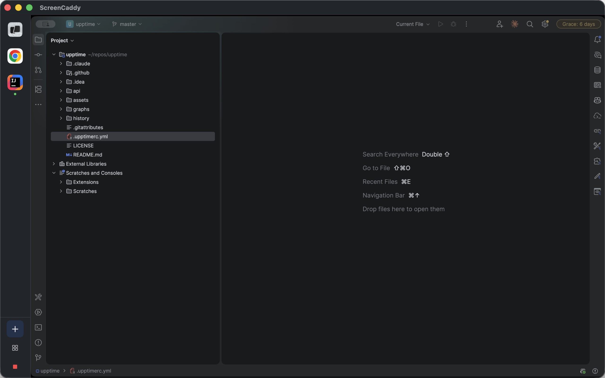

# ScreenCaddy

A macOS Dock app that captures and mirrors selected app windows. Pick which apps to share, let capture auto-switch as you move between them, and see an overlay on the window that is currently being captured.

[Download on the Mac App Store](https://apps.apple.com/au/app/screencaddy/id6760108218) · [Download the latest DMG](https://github.com/HelloAllan/screencaddy/releases/latest/download/ScreenCaddy.dmg)



## Features

- Choose exactly which apps are shared, so nothing else leaks into a screen share
- Auto-switches capture to the active app
- Focus mode (one app) and tile mode (several apps at once)
- Overlay on the window being captured

## Requirements

- macOS 14+
- Screen Recording permission (System Settings → Privacy & Security → Screen Recording)
- Swift 5.9+ toolchain

## Build

Run from the `app/` directory:

```bash
swift build                # debug build
swift build -c release     # release build
make run                   # release build, create .app bundle, open it
make bundle                # create .app bundle only
make clean                 # clean build artifacts
```

The `bundle`, `appstore` and `dmg` targets sign with the author's Apple Developer identity. To build locally, change the `codesign --sign` identity in `app/Makefile` (for example `--sign -` for ad-hoc signing).

## Releases

The [Release workflow](.github/workflows/release.yml) builds a universal (Apple Silicon and Intel) app, signs it with a Developer ID certificate, notarizes and staples the DMG, and publishes it as a GitHub release. The asset is always named `ScreenCaddy.dmg`, so `releases/latest/download/ScreenCaddy.dmg` is a stable download link.

To cut a release, run the workflow from the Actions tab (or the CLI) with a version. It tags the current `main` commit as `v<version>` and publishes the release:

```bash
gh workflow run release.yml --ref main -f version=1.0.1
```

Pushing a `v*` tag to a commit on `main` also triggers a release. Running the workflow without a version only builds and notarizes a DMG and attaches it to the run as an artifact, without creating a release.

Required repository secrets (Settings → Secrets and variables → Actions):

- `MACOS_CERTIFICATE`: base64-encoded Developer ID Application `.p12` (`base64 -i cert.p12 | pbcopy`)
- `MACOS_CERTIFICATE_PASSWORD`: password used when exporting the `.p12`
- `APPLE_API_KEY_P8`: contents of the App Store Connect API key (`AuthKey_XXXX.p8`)
- `APPLE_API_KEY_ID`: the API key ID
- `APPLE_API_ISSUER_ID`: the API issuer ID

## Architecture

Swift Package Manager project with a single executable target, `ScreenCaddy`, and no third-party dependencies.

```
app/Sources/ScreenCaddy/
├── main.swift         # Entry point, Dock app
├── AppDelegate.swift  # Window creation, menu bar, preferences
├── AppState.swift     # Central coordinator
├── Capture/           # ScreenCaptureKit stream wrapper
├── Monitor/           # Active window and running apps tracking
├── Overlay/           # "Being shared" overlay panel
├── Views/             # SwiftUI views
└── Utilities/         # Preferences, permissions, debouncer
```

`CaptureEngine` wraps ScreenCaptureKit's `SCStream` and renders frames into a `CALayer`. `AppState` owns one engine in focus mode and one per app in tile mode.

## License

[MIT](LICENSE)
